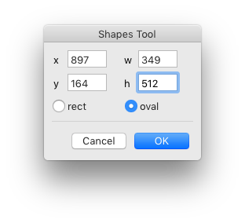

Shape Tool
==========

An interactive tool to draw primitive geometric shapes: rectangles and ovals.

Installation
------------

Download and double-click the `.roboFontExt` file to install manually, or get it via [Mechanic2](http://robofontmechanic.com/).

When installed, ShapeTool becomes available from the Glyph Editor’s toolbar.

Usage
-----

- open the Glyph Editor
- click on the ShapeTool icon to activate it 

<!-- add a nice simple .gif screencast here -->

### Actions

The following actions are supported:

| action | description
|-|-|
| click + drag | define the size of the shape interactively |
| ⌥ + click + drag | switch shape primitve to oval |
| ⌃ + click + drag | move the shape around with fixed size |
| ⌘ + click + drag | define the shape size from center |
| double click | show a modal window for nummerical input of position and size |

